# QuantumClaw

[](https://crates.io/crates/quantumclaw)
[](https://pypi.org/project/quantumclaw-dwave/)

**The world's first quantum-powered Claw agent runtime.**

**QuantumClaw = a general-purpose agent runtime built on ZeroClaw, with hybrid classical + quantum-inspired planning, and future quantum backend portability by design.**

QuantumClaw is a general-purpose claw runtime for autonomous agents. It brings quantum-powered planning semantics to the Claw ecosystem: classical planners today, quantum-inspired solvers now, and portable future QPU backends when the hardware/software stack is ready. It is not an IoT or home automation product. Those can exist as optional domain packs, but the product identity is a domain-agnostic runtime for coding agents, research agents, workflow automation, CLI agents, enterprise assistants, messaging agents, browser-capable agents, and future specialized packs.

## What it is

QuantumClaw sits on top of the real [`zeroclaw`](https://crates.io/crates/zeroclaw) crate and provides a strongly typed Rust foundation for long-running, memory-enabled, multi-tool agents. ZeroClaw supplies the Claw substrate — runtime adapters, tool traits, config, and memory contracts — while QuantumClaw adds the quantum planning layer above it.

Its differentiator is first-class hybrid planning:

- classical planners today
- quantum-inspired planners now
- future real quantum backends later
- no application/runtime rewrite when solver backends change

Planning is not hidden inside prompts or tools. `Planner` and `SolverBackend` are peers of ZeroClaw-backed memory, tools, providers, channels, policy, runtime adapters, subagents, and observability.

Proof that the base is ZeroClaw:

```sh
cargo tree -i zeroclaw
```

Expected result includes `zeroclaw v0.1.7` feeding `quantumclaw-runtime`, `quantumclaw-tools`, and `quantumclaw-app`.

## Distribution model

QuantumClaw is distributed on crates.io as a **single public crate**:

```toml
[dependencies]
quantumclaw = "0.3.0"
```

The D-Wave lanes additionally need the Ocean bridge, published separately on
PyPI as [`quantumclaw-dwave`](https://pypi.org/project/quantumclaw-dwave/),
because Ocean is a Python SDK. It is optional: QuantumClaw builds, runs, and
tests without it, and the D-Wave backends report an actionable
`ocean_missing` error when it is absent.

All implementation components remain internal workspace crates with `publish = false`. They are hidden from crates.io so consumers have one public dependency surface: `quantumclaw`. Application code should use `use quantumclaw::prelude::*;` or short module paths such as `quantumclaw::planner`, `quantumclaw::runtime`, `quantumclaw::memory`, `quantumclaw::tools`, and `quantumclaw::policy`.

The publishable crate mirrors internal component APIs into one product, one brand, one crate. End users should not depend on, import, or need to know `quantumclaw-core`, `quantumclaw-runtime`, `quantumclaw-planner`, or any other internal crate.

## Workspace layout

- `quantumclaw`: only publishable public crate; single-crate distribution surface for consumers
- `quantumclaw-core`: private implementation crate (`publish = false`) with shared platform traits and common runtime types
- `quantumclaw-runtime`: ZeroClaw-native runtime base, sessions, channels, routing, orchestration loop, adapters, subagents, policy/tool/planner/memory integration
- `quantumclaw-memory`: working, short-term, episodic, semantic, and procedural memory abstractions
- `quantumclaw-planner`: planner modes, request/response models, backend selection, explainable plans, shadow comparison
- `quantumclaw-ir`: backend-neutral decision IR for goals, tasks, constraints, actions, costs, risks, budgets, rollback, and metadata
- `quantumclaw-solvers-classical`: greedy solver plus classical search/optimization solver stubs
- `quantumclaw-solvers-qinspired`: quantum-inspired solver stub, QUBO-like and Ising-like placeholder mappings
- `quantumclaw-solvers-future-qpu`: feature-gated placeholder adapters for future QPU SDK integration
- `quantumclaw-optimization`: domain-neutral QUBO/BQM compiler, penalty encoding, slack variables, and solution decoding
- `quantumclaw-providers-dwave`: D-Wave Ocean provider — local classical simulated annealing, exhaustive search, Leap hybrid, and QPU backends behind a Python sidecar
- `quantumclaw-brains`: `QuantumBrain` abstraction and the registry that routes agent tasks to a domain brain
- `quantumclaw-brains-router`: Q-Router, the logistics brain (VRP/CVRP/VRPTW modelling, decomposition, route decoding, logistics KPIs, benchmarking)
- `quantumclaw-tools`: adapters around `zeroclaw::tools::Tool`, policy-controlled registry, calls, schemas, permissions, and tool stubs
- `quantumclaw-policy`: deterministic policy, permissions, risk levels, human confirmation, auditing, domain policy packs
- `quantumclaw-skills`: procedural skills, templates, execution records, retrievers, recipes, and learning pipeline
- `quantumclaw-observability`: traces, metrics, backend telemetry, planner comparisons, execution traces, audit sinks
- `quantumclaw-app`: runnable end-to-end example
- `spikes`: disposable feasibility experiments for optional solver/backend lanes before they become production crates

## Architecture



Rendered from [`docs/diagrams/quantumclaw-architecture.mmd`](docs/diagrams/quantumclaw-architecture.mmd).

## Architecture layers

1. **Runtime layer**
   - sessions
   - channels
   - message routing
   - tool calling
   - prompts
   - provider integration
   - observability
   - runtime adapters

2. **Cognitive layer**
   - task decomposition
   - planning
   - subagent orchestration
   - memory interaction
   - learned procedures

3. **Problem layer**
   - backend-neutral IR for goals, tasks, constraints, actions, scoring, risks, budgets, and rollback

4. **Solver layer**
   - classical solvers
   - quantum-inspired solvers
   - D-Wave Ocean provider: `dwave-sa`, `dwave-sqa`, `dwave-exact`, `dwave-hybrid`, `dwave-qpu`
   - future QPU adapters
   - optional CUDA-Q experiments as spike/backend candidates, not core runtime dependencies

5. **Domain brain layer**
   - `QuantumBrain` abstraction with `can_handle`, `validate`, `plan`, `formulate`, `decompose`, `solve`, `evaluate`, `explain`
   - Q-Router as the first implementation
   - brains own domain knowledge; they never own solvers

5. **Execution and policy layer**
   - deterministic validation
   - permissions
   - tool execution
   - retries
   - auditing
   - rollback

## Core traits

QuantumClaw exposes these platform traits as first-class extension points:

- `AgentRuntime`
- `Planner`
- `ProblemEncoder`
- `SolverBackend`
- `PlanDecoder`
- `MemoryStore`
- `SkillStore`
- `Tool`
- `ToolRegistry`
- `PolicyEngine`
- `Observer`
- `SubagentRegistry`
- `RuntimeAdapter`

## Planner modes

- `Reactive`: favor low-latency classical planning
- `Deliberative`: favor richer planning when latency allows
- `Hybrid`: combine classical and quantum-inspired candidates
- `ClassicalOnly`: force classical backend selection
- `QuantumInspiredPreferred`: prefer quantum-inspired backend when present
- `Auto`: select from task type, latency budget, confidence, environment, and policy
- `ShadowCompare`: one backend produces the executable plan while another runs silently for telemetry and benchmarking

## IR overview

`quantumclaw::ir` exposes a backend-neutral `DecisionProblem` made of:

- `Goal`
- `Subtask`
- `CandidateAction`
- `Dependency`
- `Preconditions`
- `Postconditions`
- `Constraint`
- `CostModel`
- `RiskModel`
- `UtilityScore`
- `Deadline`
- `ResourceBudget`
- `ConfidenceEstimate`
- `RollbackStrategy`
- `ExecutionMetadata`

The IR does not encode a solver implementation. Classical, quantum-inspired, and future QPU backends consume the same problem shape.

## Solver backend model

A `SolverBackend` receives a `DecisionProblem` plus execution context and returns scored plan candidates with telemetry. The runtime and application layer depend on the trait, not on a solver implementation.

Current scaffolding:

- `GreedySolver`
- `BeamSearchSolver` stub
- `HeuristicSearchSolver` stub
- `BranchAndBoundSolver` stub
- `SimulatedAnnealingSolver` stub
- `EvolutionarySolver` stub
- `QuantumInspiredSolver` stub
- `QuboLikeProblem` placeholder
- `IsingLikeMapping` placeholder
- `FutureQpuBackend` trait and feature-gated future SDK hook

Experimental backend spikes:

- [`spikes/001-cudaq-qaoa-backend`](spikes/001-cudaq-qaoa-backend/): evaluates CUDA-Q as an optional Python sidecar for QAOA-style solving over QuantumClaw's QUBO-like planning payloads. This is intentionally not a core dependency yet; it should graduate only after `ShadowCompare` benchmarks show useful quality/latency tradeoffs.

## Security and policy model

QuantumClaw separates deterministic policy from probabilistic planning.

The policy layer can:

- validate permissions
- restrict unsafe tool use
- require human confirmation above risk thresholds
- audit proposed plans
- audit executed plans
- apply domain-specific policy packs

The planner may propose. The policy engine decides what can execute.

## Procedural learning model

QuantumClaw supports procedural learning without model fine-tuning:

1. Capture successful executions.
2. Summarize why the execution worked.
3. Convert the result into reusable skills, plans, or templates.
4. Store it in procedural memory.
5. Retrieve similar skills for future tasks.

The `quantumclaw::skills` module exposes `Skill`, `SkillTemplate`, `SkillExecutionRecord`, `SkillLearningPipeline`, `SkillRetriever`, and `PlanningRecipe`.

## Example task flow

The runnable app demonstrates:

> “Plan a safe coding refactor for a Rust module.”

Flow:

1. User asks for refactor.
2. Runtime creates a session.
3. Memory retrieves relevant prior procedures.
4. Planner creates a `DecisionProblem`.
5. Classical or quantum-inspired backend proposes plans.
6. Policy validates the plan.
7. Tool registry resolves code/file/shell tools.
8. Runtime simulates execution.
9. Observer records telemetry.
10. Successful plan is converted into a reusable procedural skill.

Run it:

```sh
cargo run -p quantumclaw-app
```

Run tests:

```sh
cargo test
```

## Practical usage examples

QuantumClaw is meant to be embedded into agent applications as the planning,
policy, memory, and solver layer. The runnable examples below show concrete ways
to use the runtime instead of only showing API fragments.

### 1. Safe code-refactor agent

Use this pattern when you want an engineering agent to plan a code change before
it touches files or runs tools.

```sh
cargo run -p quantumclaw-app --example safe_code_refactor
```

What it demonstrates:

- Seeds procedural memory with a known safe Rust-refactor recipe.
- Builds a runtime with classical and quantum-inspired solver backends.
- Plans a refactor task through `QuantumClawRuntime::handle_user_task`.
- Runs deterministic policy before simulated execution.
- Captures the successful run as a learned skill.

Expected output shape:

```text
task: Refactor the memory ranking module without changing public behavior, then validate it.
selected backend: quantum-inspired-hybrid
policy allowed: true
retrieved procedures: 1
plan steps:
  1. [low] Run validation suite via shell
  2. [low] Add characterization tests via shell
  3. [low] Apply focused code edit via code_edit
  4. [low] Inspect target module via filesystem
learned skill: skill-refactor-the-memory-ranking-module-without-chang
```

A real agent would replace the stub tools with concrete file, shell, browser, or
API tools while keeping the same planner/policy/memory flow.

### 2. Incident triage with ShadowCompare

Use this pattern when you want to benchmark whether the classical or
quantum-inspired planner is better for a workflow before committing to one.

```sh
cargo run -p quantumclaw-app --example incident_triage_shadow_compare
```

What it demonstrates:

- Models a production-deploy triage task as a generic workflow.
- Runs `PlannerMode::ShadowCompare`.
- Prefers the quantum-inspired backend as primary.
- Executes the classical backend as a shadow planner for comparison telemetry.
- Prints the selected plan and utility/confidence scores.

Expected output shape:

```text
primary backend: quantum-inspired-hybrid
utility: 0.93
confidence: 0.90
shadow backend: greedy-classical
primary utility 0.93 vs shadow utility 0.92
triage plan:
  1. Collect failing checks and customer-impact signals (search)
  2. Compare current deploy against last known-good release (filesystem)
  3. Choose rollback or fix-forward path (external-api)
  4. Validate recovery gates before closing incident (shell)
```

This is useful for CI/CD agents, incident-response copilots, operations bots,
and any workflow where you want backend evaluation without changing runtime
code.

### 3. Release guardrail / policy gate

Use this pattern when an agent proposes a plan but you need a deterministic
safety gate before any tool execution.

```sh
cargo run -p quantumclaw-app --example release_guardrail
```

What it demonstrates:

- Builds a release-cutover plan with medium, high, and critical-risk steps.
- Evaluates the plan with `DeterministicPolicyEngine`.
- Rejects critical-risk actions before execution.
- Produces an audit event that can be stored or shown to a human reviewer.

Expected output shape:

```text
allowed: false
risk: critical
requires confirmation: false
reason: critical risk plan rejected by deterministic policy
audit events: 1
```

This pattern is appropriate for deployment agents, data-migration agents,
automated code-modification agents, and enterprise assistants that need hard
policy boundaries.

### 4. Embedded runtime pattern

The examples use the same embedding pattern:

```rust
let runtime = QuantumClawRuntime::new(
    vec![
        Arc::new(GreedySolver) as Arc<dyn SolverBackend>,
        Arc::new(QuantumInspiredSolver::default()),
    ],
    procedural_memory,
    InMemoryToolRegistry::with_default_tools(),
    DeterministicPolicyEngine::default(),
    InMemoryObserver::default(),
);

let report = runtime
    .handle_user_task("Plan and validate a risky autonomous task")
    .await?;
```

From there, your application can inspect:

- `report.retrieved_procedures` for memory hits.
- `report.plan` for selected backend, steps, risk, score, and rationale.
- `report.policy_decision` for allow/deny/confirmation state.
- `report.execution` for resolved tool calls and simulated results.
- `report.telemetry` for traces and backend comparisons.
- `report.learned_skill` for procedural learning.

### 5. Practical applications

QuantumClaw can be used as the core planner/runtime layer for:

- Coding agents that must plan, validate, and learn safe refactor procedures.
- CI/CD agents that triage failures and choose rollback vs. fix-forward plans.
- Research agents that decompose ambiguous requests into ranked actions.
- Enterprise assistants that need policy checks before calling tools or APIs.
- Multi-agent orchestrators that compare planning strategies before dispatching
  work.
- Future QPU-backed planners where the solver backend changes but the runtime,
  IR, memory, tools, and policy layers stay stable.

## API usage snippets

### Run the end-to-end demo

```sh
cargo run -p quantumclaw-app
```

Expected shape:

```text
QuantumClaw demo completed
task: Plan a safe coding refactor for a Rust module.
backend: quantum-inspired-hybrid
steps: 4
learned_skill: skill-plan-a-safe-coding-refactor-for-a-rust-module
```

### Use QuantumClaw as an embedded runtime

```rust
use quantumclaw::prelude::*;
use std::sync::Arc;

#[tokio::main]
async fn main() -> Result<()> {
    let backends: Vec<Arc<dyn SolverBackend>> = vec![
        Arc::new(GreedySolver),
        Arc::new(QuantumInspiredSolver::default()),
    ];

    let runtime = QuantumClawRuntime::new(
        backends,
        InMemoryProceduralMemory::default(),
        InMemoryToolRegistry::with_default_tools(),
        DeterministicPolicyEngine::default(),
        InMemoryObserver::default(),
    );

    let report = runtime
        .handle_user_task("Plan a safe coding refactor for a Rust module.")
        .await?;

    println!("selected backend: {}", report.plan.backend);
    println!("learned skill: {}", report.learned_skill.id);
    Ok(())
}
```

### Switch planner backends without changing runtime code

```rust
use quantumclaw::prelude::*;
use std::sync::Arc;

async fn example() -> Result<()> {
    let planner = HybridPlanner::default();
    let task = AgentTask::new("Plan a research workflow");

    let classical = planner
        .plan(
            PlannerRequest::new(task.clone())
                .with_mode(PlannerMode::ClassicalOnly)
                .with_backend(Arc::new(GreedySolver))
                .with_backend(Arc::new(QuantumInspiredSolver::default())),
        )
        .await?;

    let qinspired = planner
        .plan(
            PlannerRequest::new(task)
                .with_mode(PlannerMode::QuantumInspiredPreferred)
                .with_backend(Arc::new(GreedySolver))
                .with_backend(Arc::new(QuantumInspiredSolver::default())),
        )
        .await?;

    assert_eq!(classical.primary_plan().backend_kind, SolverKind::Classical);
    assert_eq!(qinspired.primary_plan().backend_kind, SolverKind::QuantumInspired);
    Ok(())
}
```

### Run ShadowCompare for backend benchmarking

```rust
use quantumclaw::prelude::*;
use std::sync::Arc;

async fn example() -> Result<()> {
    let response = HybridPlanner::default()
        .plan(
            PlannerRequest::new(AgentTask::new("Compare planning backends"))
                .with_mode(PlannerMode::ShadowCompare)
                .with_selection_policy(
                    BackendSelectionPolicy::prefer(SolverKind::Classical).with_shadow(true),
                )
                .with_backend(Arc::new(GreedySolver))
                .with_backend(Arc::new(QuantumInspiredSolver::default())),
        )
        .await?;

    let comparison = response.telemetry.shadow_comparison.expect("shadow telemetry");
    println!("primary: {}", comparison.primary_backend);
    println!("shadow: {}", comparison.shadow_backend);
    Ok(())
}
```

### Store and retrieve procedural memory

```rust
use quantumclaw::prelude::*;

async fn example() -> Result<()> {
    let memory = InMemoryProceduralMemory::default();

    memory
        .store_procedure(StoredProcedure::new(
            "safe-rust-refactor",
            "Inspect interfaces, add tests, make small reversible edits, then validate.",
            ["rust", "refactor", "tests", "validation"],
        ))
        .await?;

    let matches = memory
        .retrieve_similar("refactor a Rust module with validation", 3)
        .await?;

    assert_eq!(matches[0].id, "safe-rust-refactor");
    Ok(())
}
```

### Validate a plan with deterministic policy

```rust
use quantumclaw::prelude::*;

async fn example() -> Result<()> {
    let plan = Plan {
        id: "safe-plan".into(),
        backend: "greedy-classical".into(),
        backend_kind: SolverKind::Classical,
        steps: vec![PlanStep::new("run test suite", "shell").with_risk(RiskLevel::Medium)],
        score: PlanScore::default(),
        rationale: PlannerRationale::new("Small reversible execution plan"),
        metadata: Default::default(),
    };

    let decision = DeterministicPolicyEngine::default()
        .evaluate_plan(&plan)
        .await?;

    assert!(decision.allowed);
    Ok(())
}
```

## Roadmap

- Add richer deterministic validators for plan preconditions and postconditions.
- Add provider adapters for local and remote model APIs.
- Add durable memory backends beyond in-memory stores.
- Add richer graph encoders for large task/action graphs.
- Add real beam search, branch-and-bound, annealing, and evolutionary implementations.
- Add benchmark harness for `ShadowCompare` backend evaluation.
- Validate the CUDA-Q QAOA sidecar spike in a CUDA-Q-ready CPU/GPU environment before adding a production `quantumclaw-solvers-cudaq` crate.
- Add optional domain policy packs without changing core identity.
- Add feature-gated QPU SDK adapters when stable vendor APIs justify integration.

## Optimization, D-Wave, and Q-Router

QuantumClaw compiles binary decision problems into a QUBO/BQM and hands them to
whichever backend is selected by name. D-Wave is one provider among several,
and no D-Wave type appears in the core domain models.

```
DecisionProblem / OptimizationProblem
        ↓  quantumclaw-optimization
BQM (minimization form, penalty-encoded constraints)
        ↓  SolverBackend
classical | dwave-sa | dwave-sqa | dwave-exact | dwave-hybrid | dwave-qpu
        ↓
SolverOutput + OptimizationSolution + provider metadata
```

`dwave-sa` runs `dwave.samplers.SimulatedAnnealingSampler`: **classical**
simulated annealing over an Ocean-compatible BQM. It is not a QPU simulator.
`dwave-sqa` runs `dwave.samplers.PathIntegralAnnealingSampler`, a **local
emulator** of quantum annealing dynamics on your CPU: quantum-inspired, never
labelled as a quantum device.

### What the sweep shows

`scripts/benchmark_sweep.py` runs every backend over deterministic instances of
5–10 stops, two seed bases, five repeats each, and ranks on **feasibility
first, then median objective** — the same rule the benchmark CLI uses.
`feasible` is per seed base (5 runs each); `median` is the median objective
per seed base; `solver ms` is the mean in-sampler time:

| stops | backend | feasible | median | solver ms |
|---|---|---|---|---|
| 5 | classical | 5/5 · 5/5 | 392.6 · 392.6 | — |
| 5 | greedy-classical † | 5/5 · 5/5 | 392.6 · 392.6 | — |
| 5 | beam-search-classical † | 5/5 · 5/5 | 392.6 · 392.6 | — |
| 5 | heuristic-search-classical † | 5/5 · 5/5 | 392.6 · 392.6 | — |
| 5 | branch-and-bound-classical † | 5/5 · 5/5 | 392.6 · 392.6 | — |
| 5 | simulated-annealing-classical † | 5/5 · 5/5 | 392.6 · 392.6 | — |
| 5 | evolutionary-classical † | 5/5 · 5/5 | 392.6 · 392.6 | — |
| 5 | quantum-inspired-hybrid † | 5/5 · 5/5 | 392.6 · 392.6 | — |
| 5 | dwave-sa | 3/5 · 5/5 | 342.4 · 401.7 | 36 |
| 5 | dwave-sqa | 5/5 · 5/5 | 392.6 · 396.3 | 567 |
| 6 | classical | 0/5 · 0/5 ✗ | 391.4 · 391.4 | — |
| 6 | greedy-classical † | 0/5 · 0/5 ✗ | 391.4 · 391.4 | — |
| 6 | beam-search-classical † | 0/5 · 0/5 ✗ | 391.4 · 391.4 | — |
| 6 | heuristic-search-classical † | 0/5 · 0/5 ✗ | 391.4 · 391.4 | — |
| 6 | branch-and-bound-classical † | 0/5 · 0/5 ✗ | 391.4 · 391.4 | — |
| 6 | simulated-annealing-classical † | 0/5 · 0/5 ✗ | 391.4 · 391.4 | — |
| 6 | evolutionary-classical † | 0/5 · 0/5 ✗ | 391.4 · 391.4 | — |
| 6 | quantum-inspired-hybrid † | 0/5 · 0/5 ✗ | 391.4 · 391.4 | — |
| 6 | dwave-sa | 4/5 · 3/5 | 453.7 · 437.9 | 41 |
| 6 | dwave-sqa | 3/5 · 4/5 | 453.7 · 437.9 | 641 |
| 7 | classical | 0/5 · 0/5 ✗ | 372.2 · 372.2 | — |
| 7 | greedy-classical † | 0/5 · 0/5 ✗ | 372.2 · 372.2 | — |
| 7 | beam-search-classical † | 0/5 · 0/5 ✗ | 372.2 · 372.2 | — |
| 7 | heuristic-search-classical † | 0/5 · 0/5 ✗ | 372.2 · 372.2 | — |
| 7 | branch-and-bound-classical † | 0/5 · 0/5 ✗ | 372.2 · 372.2 | — |
| 7 | simulated-annealing-classical † | 0/5 · 0/5 ✗ | 372.2 · 372.2 | — |
| 7 | evolutionary-classical † | 0/5 · 0/5 ✗ | 372.2 · 372.2 | — |
| 7 | quantum-inspired-hybrid † | 0/5 · 0/5 ✗ | 372.2 · 372.2 | — |
| 7 | dwave-sa | **5/5 · 5/5** | **428.4 · 436.9** | 44 |
| 7 | dwave-sqa | 3/5 · 3/5 | 409.1 · 416.8 | 747 |
| 8 | classical | 5/5 · 5/5 | 490.8 · 490.8 | — |
| 8 | greedy-classical † | 5/5 · 5/5 | 490.8 · 490.8 | — |
| 8 | beam-search-classical † | 5/5 · 5/5 | 490.8 · 490.8 | — |
| 8 | heuristic-search-classical † | 5/5 · 5/5 | 490.8 · 490.8 | — |
| 8 | branch-and-bound-classical † | 5/5 · 5/5 | 490.8 · 490.8 | — |
| 8 | simulated-annealing-classical † | 5/5 · 5/5 | 490.8 · 490.8 | — |
| 8 | evolutionary-classical † | 5/5 · 5/5 | 490.8 · 490.8 | — |
| 8 | quantum-inspired-hybrid † | 5/5 · 5/5 | 490.8 · 490.8 | — |
| 8 | dwave-sa | 5/5 · 5/5 | 468.9 · 470.0 | 50 |
| 8 | dwave-sqa | **5/5 · 5/5** | **441.5 · 441.5** | 854 |
| 10 | classical | 5/5 · 5/5 | **500.9 · 500.9** | — |
| 10 | greedy-classical † | 5/5 · 5/5 | 500.9 · 500.9 | — |
| 10 | beam-search-classical † | 5/5 · 5/5 | 500.9 · 500.9 | — |
| 10 | heuristic-search-classical † | 5/5 · 5/5 | 500.9 · 500.9 | — |
| 10 | branch-and-bound-classical † | 5/5 · 5/5 | 500.9 · 500.9 | — |
| 10 | simulated-annealing-classical † | 5/5 · 5/5 | 500.9 · 500.9 | — |
| 10 | evolutionary-classical † | 5/5 · 5/5 | 500.9 · 500.9 | — |
| 10 | quantum-inspired-hybrid † | 5/5 · 5/5 | 500.9 · 500.9 | — |
| 10 | dwave-sa | 5/5 · 5/5 | 517.4 · 526.1 | 60 |
| 10 | dwave-sqa | 5/5 · 5/5 | 538.2 · 520.7 | 1184 |

**Bold = the winning lane for that size** (feasibility first, then median). The
headline case: at **8 stops the quantum annealing emulator wins outright** —
441.5 against 468.9 (`dwave-sa`) and 490.8 (classical), every run feasible on
both seed bases.

- ✗ = infeasible on every run: the greedy path strands deliveries on tight
  capacity. Feasibility is ranked first, so a cheaper plan that cannot serve
  everyone never wins — that is also why `dwave-sa`'s 342.4 at 5 stops is not
  the winner (feasible only 3/5 on that seed base).
- At 6 stops the winner splits by seed base: `dwave-sa` (453.7, 4/5) on seed
  base 1 and `dwave-sqa` (437.9, 4/5) on seed base 2.
- † the classical-named backends all return the same numbers because none
  supports quadratic models — each silently resolves to the brain's
  cheapest-insertion fallback, shown as `classical`. Only `classical`,
  `dwave-sa`, and `dwave-sqa` are distinct lanes today.
- Numbers are example output and move with the installed Ocean version;
  reproduce them with `python3 scripts/benchmark_sweep.py`.

### Quick start

```sh
# Ocean lives behind a Python sidecar, so it never enters a QuantumClaw build.
pip install "quantumclaw-dwave[local]"
export QUANTUMCLAW_DWAVE_PYTHON=$(which python)

cargo run -p quantumclaw-app --bin quantumclaw -- backends
cargo run -p quantumclaw-app --bin quantumclaw -- solve problem.json --backend dwave-sa
cargo run -p quantumclaw-app --bin quantumclaw -- benchmark problem.json \
    --primary greedy-classical --shadow dwave-sa

# Q-Router, the logistics brain
cargo run -p quantumclaw-app --bin quantumclaw -- \
    qrouter benchmark crates/quantumclaw-app/examples/data/sao-paulo-deliveries.json \
    --backends classical,dwave-sa,dwave-sqa
```

`dwave-sqa` is the local quantum annealing emulator lane; the benchmark ranks
candidates on feasibility first, then median objective, and `qrouter.md`
shows what that surfaces.

Details: [`docs/providers/dwave.md`](docs/providers/dwave.md) and
[`docs/brains/qrouter.md`](docs/brains/qrouter.md).

Known gaps, deferred work, and what was deliberately not built are recorded in
[`ROADMAP.md`](ROADMAP.md).
